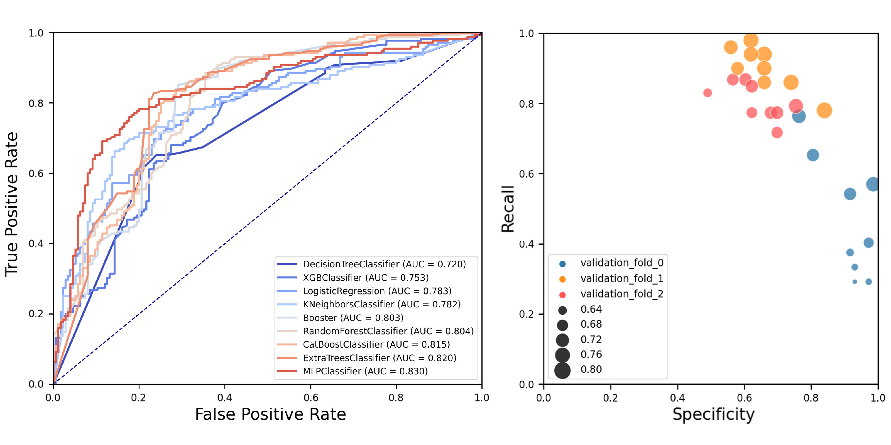
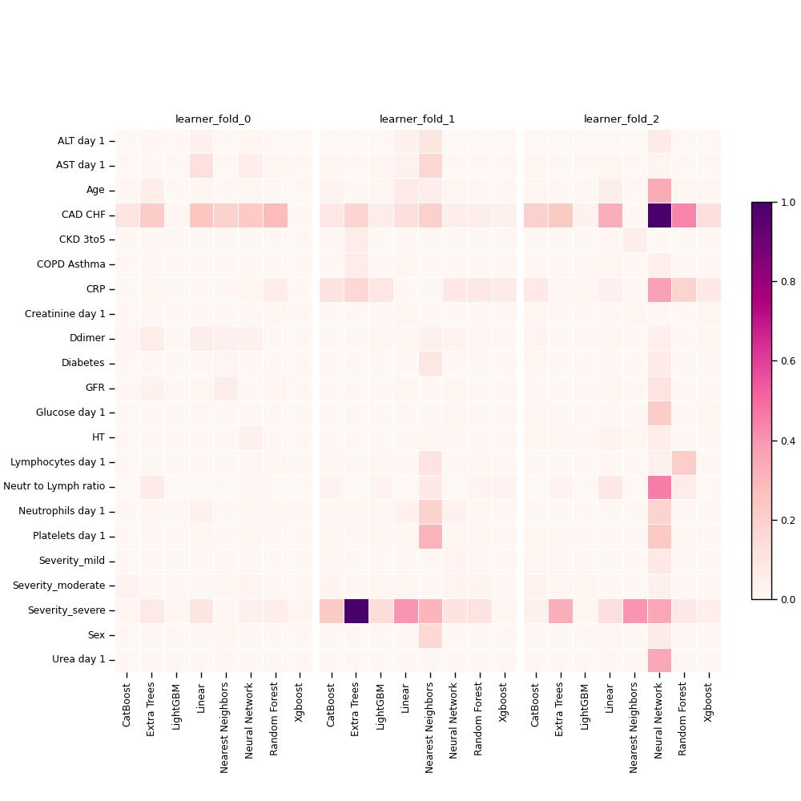

# 
 COVID-19 outcome prediction models   based on machine learning algorithms 

## Project description
Using the given code, we performed a multicenter, age- and sex-matched study to compare the efficiency of various machine learning algorithms in prediction of COVID-19 fatal outcomes and to develop sensitive, specific, and robust artificial intelligence tools for the prompt triage of patients with severe COVID-19 in the intensive care unit setting. In a challenge against other established machine learning algorithms (decision trees, random forests, extra trees, neural networks, k-nearest neighbours, and gradient boosting: XGBoost, LightGBM, and CatBoost) and multivariate logistic regression as a reference, neural networks demonstrated the highest sensitivity, sufficient specificity and excellent robustness. Further, neural networks based on coronary artery disease/chronic heart failure, stage 3-5 chronic kidney disease, blood urea nitrogen, and C-reactive protein as the predictors exceeded 90% sensitivity and 80% specificity, reaching AUROC of 0.866 at primary cross-validation and 0.849 at secondary cross-validation on virtual samples generated by the bootstrapping procedure. These results underscore the impact of cardiovascular and renal comorbidities in context of thrombotic complications characteristic of severe COVID-19. As aforementioned predictors can be obtained from the case histories or are inexpensive to be measured at the admission to intensive care unit, we suggest this predictor composition as useful for the triage of critically ill COVID-19 patients.

## Documentation
Project contains the following files:

File | Description
---- | -----------
requirements.txt | file listing all the dependencies for the given project
/dataset/ | the dataset of age- and sex-matched patients from three clinics
data_processing.py | script for the data preprocessing
ml.py | code for the machine learning using MLJAR AutoML (https://github.com/mljar/mljar-supervised)
analysis.py | code for the study of the ML algorithms performance
visualization_tools.py | utilities for the data visualization

## Results

  ML classification metrics
  

  Feature Importance Heatmap of 3-custom-fold cross-validation
  

